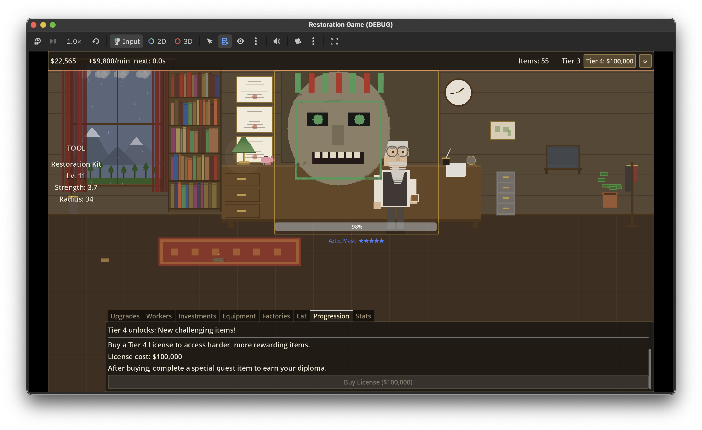

# Restoration Game

An incremental/idle game about restoring damaged antiques. Hover your tool over items to clean away layers of damage, earn money, upgrade your workshop, hire workers, and expand your restoration empire.

Built with **Godot 4.6** and **GDScript**.



## How to Play

- **Restore items** by hovering your Restoration Kit over damaged areas — no clicking needed
- **Earn money** for each completed restoration
- **Upgrade your tool** to increase strength and radius
- **Hire workers** for passive income
- **Progress through tiers** to unlock harder, more rewarding items
- **Expand** into investments, equipment, and factories

## Features

### Core Mechanics
- **Image-based mask painting** — damage is revealed via shader, cleaned by hovering the tool
- **Layered cleaning** — harder items require multiple passes through different damage layers
- **5 difficulty levels** (1-5 stars) with increasing reward bonuses
- **Master's Touch** — 15% chance of 2x reward on manual restores

### Workshop
- Cozy office scene with bookshelves, clock, plants, and furniture
- **Old man character** that walks between 7 destinations (window, bookshelf, tea, cabinet, fish tank, plant, wander)
- **Cat companion** with 8 behavioral states (idle, walk, jump, struggle, interact, visit, nap, follow) — upgradeable for bonuses
- **Weather system** — 6 types (sunny, cloudy, rain, snow, night, rainbow)

### Economy
- **Single upgradeable tool** — "Restoration Kit" with infinite levels, milestone bonuses every 10 levels
- **Workers** — Art Students ($50/min) and Professionals ($500/min, tier 3+)
- **Investments** — 3 tiers: Savings, Bonds, Stocks
- **Equipment** — 6 items including Ultrasonic Cleaner, Chemical Bath, Laser Scanner, Office Aquarium (+15% factory income), Piggy Bank (compound savings)
- **Factories** — 5 cities with bureaucracy/attorney system (tier 3+)

### Progression
- **4 tiers currently implemented** (of 8 planned)
- Tier advancement via license purchase + quest item completion
- 20 unique items across tiers — vases, clocks, keyboards, medals, Egyptian/Aztec artifacts, samurai armor, and more
- 4 damage types: dust, rust, grime, cracks

### Quality of Life
- Autosave every 30 seconds
- Offline earnings (workers produce at 50% efficiency, up to 24h)
- Dark wood-themed UI with gold accents
- Settings panel with sound/music controls

## Tech Stack

| | |
|---|---|
| **Engine** | Godot 4.6 |
| **Language** | GDScript |
| **Renderer** | GL Compatibility (for web export) |
| **Resolution** | 1920x1080, landscape |
| **Art style** | 2D pixel art (128x128 item textures) |
| **Platforms** | Web (HTML5) + Desktop |

## Architecture

- **4 Autoloads**: Events (signal bus), GameManager (state), SaveManager (persistence), AudioManager (sound)
- **Data model**: Godot Resources (`.tres` files) — all game data in `data/resources/`
- **Core shader**: `damage_reveal.gdshader` — damage overlay with item shape masking
- **Economy config**: All balance constants centralized in `economy_config.gd`

## Project Structure

```
assets/sprites/          — pixel art (items, damage overlays, tools, UI, workers)
data/resources/          — .tres game data (items, tools, damage types, workers)
scenes/                  — scene files + attached scripts
  main/                  — main scene entry point
  workshop/              — office background, cat, old man
  restoration/           — item restoration mechanic
  ui/                    — all UI panels (upgrades, workers, investments, etc.)
scripts/
  autoloads/             — singletons (Events, GameManager, SaveManager, AudioManager, Format)
  resources/             — Resource class definitions
  components/            — worker AI
  debug/                 — editor tools (pixel art generator, economy plotter)
shaders/                 — GLSL shaders
docs/                    — design documentation
```

## How to Run

1. Open the project in **Godot 4.6**
2. Press **F5** to run

### Editor Tools

- **Generate pixel art**: Open `scripts/debug/generate_pixel_art.gd` → Script → Run
- **Economy balance tables**: Open `scripts/debug/economy_plotter.gd` → Script → Run

## Roadmap

The game is designed around 8 progression tiers:

1. Manual restoration (implemented)
2. Hire art students (implemented)
3. Professional equipment + permanent workers (implemented)
4. Factories with bureaucracy (implemented)
5. Franchises (world expansion)
6. Paranormal (bishops, cursed items)
7. Sea nation (underwater restoration)
8. Space (Earth's orbit cleanup)
